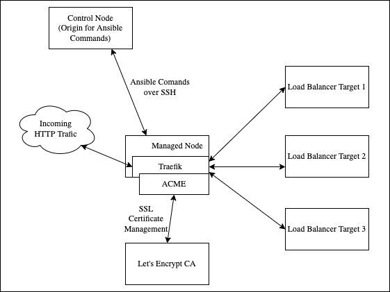

# Trailhead

Ansible playbook to setup traefik as a loadbalancer with automated ssl cert generation and renewal



## Prerequisites

- [Ansible](https://docs.ansible.com/ansible/latest/installation_guide/intro_installation.html) installed on control node
- User with SSH access from control node to managed node
- Replace placeholder values
  - [Contorl Node IP](https://github.com/nvengal/trailhead/blob/1e56d2be9b23b6d9b48045b9ad984aa29ab592a2/hosts.yml#L5)
  - [Traefik Config](https://github.com/nvengal/trailhead/blob/1e56d2be9b23b6d9b48045b9ad984aa29ab592a2/playbook.yml#L19-L30)

## How to deploy traefik using ansible

From the control node
```bash
ansible-playbook -i hosts.yml playbook.yml -u <user_with_ssh_access_to_managed_node>
```

## What's being deployed?

The roles in the `playbook.yml` file corresponding to the `roles` directory determine the infrastructure that is built on the managed node. Currently, the following roles are being deployed:

- apt
  - Installs repository tools and unattended-upgrades
- firewall
  - Installs and configures iptables to control what ports/protocols are open to external traffic
- ssh
  - Configures ssh agent and installs fail2ban
- traefik
  - Installs and configures the loadbalancer

## Traefik

Ideally, all of the configuration that needs to be modified is exposed through vars in the `playbook.yml`. If needed, all of the traefik configuration files can be found in `roles/traefik/templates`. After modifying the templates, the `ansible-playbook` command will need to be re-run to deploy the latest changes to the managed node.

### Dashboard and debugging

Traefik is run as a systemd service on the managed node.
Check the status of the service using systemctl
```
systemctl status traefik
```
See the logs using journalctl
```
journalctl -u traefik
# To follow logs
journalctl -u traefik -f
```

Traefik also has a built-in dashboard that can be accessed at `.dashboard.host` from `playbook.yml`.
Authorized users need to be configured in `playbook.yml` using `htpasswd`. See [example htpasswd generator](https://hostingcanada.org/htpasswd-generator/).

### Upgrading traefik

Traefik releases can be found at [Releases](https://github.com/traefik/traefik/releases). New releases will be detected and logged. Ex, "A new release has been found: 2.9.4. Please consider updating."

Traefik can be updated by changing the [binary url](https://github.com/nvengal/trailhead/blob/1e56d2be9b23b6d9b48045b9ad984aa29ab592a2/playbook.yml#L18) and re-running the `ansible-playbook` command.

### Automated SSL signing and renewal (for enabling HTTPS)

The ACME protocol and [Let's Encrypt](https://letsencrypt.org/how-it-works/) are used to automatically generate and renew SSL certificates.

The only required configuration in this project is `.service.host` and `.dashboard.host` in `playbook.yml`. In order to prove to the Let's Encrypt CA that you are the owner of the host requesting the SSL certificate, you will also need to create DNS records that tie the managed node ip to the configured hostnames. Note: initial certificate generation might take a few minutes. The ACME agent logs directly to the traefik journalctl log for debugging.

## TODO

- sticky sessions?
- health checks
- traefik.service todos
